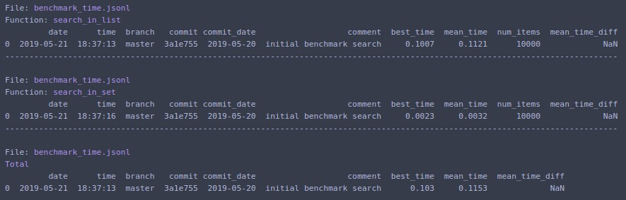
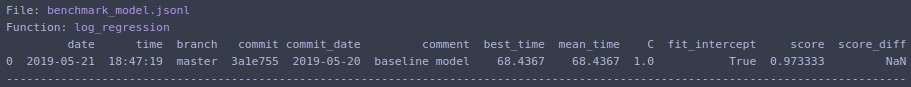
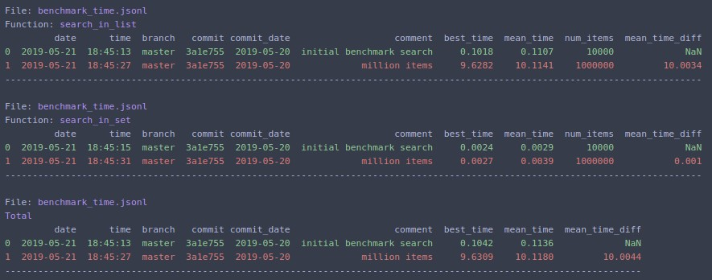

# Benchmarkit

Benchmark and analyze functions' time execution and results over the course of development. 

## Features

- No boilerplate code
- Saves history and additional info
- Saves function output and parameters to benchmark data science tasks
- Easy to analyze results

## Motivation

- I need to benchmark execution time of my function
- I don't want to memorize and write boilerplate code
- I want to compare results with previous runs before some changes were introduced
- I don't want to manually write down results somewhere
- I want to know exact commits of my previous runs months ago
- I want to benchmark accuracy, precision, recall of my models and keep track of hyperparameters 


## Usage
### Benchmark execution times

Put `@benchmark` decorator over function with piece of code that should be timed

```python
from benchmarkit import benchmark, benchmark_run

N = 10000
seq_list = list(range(N))
seq_set = set(range(N))

SAVE_PATH = '/tmp/benchmark_time.jsonl'


@benchmark(num_iters=100, save_params=True, save_output=False)
def search_in_list(num_items=N):
    return num_items - 1 in seq_list


@benchmark(num_iters=100, save_params=True, save_output=False)
def search_in_set(num_items=N):
    return num_items - 1 in seq_set
```

- __num_iters__ - how many times to repeat benchmarked function. Default _1_
- __save_params__ - save parameters passed to the benchmarked function in the file with benchmark results. In the example above `num_items` will be saved. Default _False_
- __save_output__ - save benchmarked function output. Should return dict `{'name': value}`. Default _False_. See example how to benchmark model results.

Run benchmark:

```python
benchmark_results = benchmark_run(
    [search_in_list, search_in_set],
    SAVE_PATH,
    comment='initial benchmark search',
    rows_limit=10,
    extra_fields=['num_items'],
    metric='mean_time',
    bigger_is_better=False,
)  
```

- __comment__ - comment to save alongside the results
- __rows_limit__ - limit table rows in console output. Default _10_
- __extra_fields__ - extra fields to include in console output
- __metric__ - metric which is used for comparison. Default `mean_time`
- __bigger_is_better__ - whether bigger value of metric indicates that result is better. For time benchmarks should be `False`, for model accuracy should be `True`. Default _False_



Change `N=1000000` and rerun


The same can be run from command line:
```text
benchmark_run test_data/time/benchmark_functions.py --save_dir /tmp/ --comment "million items" --extra_fields num_items
```

### Benchmark model results

```python
from benchmarkit import benchmark, benchmark_run
from sklearn.datasets import load_iris
from sklearn.linear_model import LogisticRegression

MODEL_BENCHMARK_SAVE_FILE = '/tmp/benchmark_model.jsonl'

x, y = load_iris(return_X_y=True)

@benchmark(save_params=True, save_output=True)
def log_regression(C=1.0, fit_intercept=True):
    clf = LogisticRegression(
        random_state=0, 
        solver='lbfgs', 
        multi_class='multinomial', 
        C=C,
        fit_intercept=fit_intercept,
    )
    clf.fit(x, y)
    score = clf.score(x, y)
    return {'score': score}
    
model_benchmark_results = benchmark_run(
    log_regression,
    MODEL_BENCHMARK_SAVE_FILE,
    comment='baseline model',
    extra_fields=['C', 'fit_intercept'],
    metric='score',
    bigger_is_better=True,
)
```



Change hyperparameter `C=0.5` and rerun. Output:


The same can be run from command line:
```text
benchmark_run file_with_benchmark.py --save_dir /tmp/ --comment "stronger regularization" --extra_fields C fit_intercept --metric score --bigger_is_better
```

### Analyze results from the file

```python
from benchmarkit import benchmark_analyze

SAVE_PATH = '/tmp/benchmark_time.jsonl'

benchmark_df = benchmark_analyze(
    SAVE_PATH,
    func_name=None, 
    rows_limit=10,
    metric='mean_time',
    bigger_is_better=False,
    extra_fields=['num_items'],
)
```

- __func_name__ - display statistics for particular function. If `None` then all functions, stored in file, are displayed. Default _None_
- __rows_limit__ - limit table rows in console output. Default _10_
- __metric__ - metric which is used for comparison. Default `mean_time`
- __bigger_is_better__ - whether bigger value of metric indicates that result is better. For time benchmarks should be `False`, for model accuracy should be `True`. Default _False_
- __extra_fields__ - extra fields to include in console output



The same can be run from command line:
```text
benchmark_analyze /tmp/benchmark_time.jsonl --extra_fields num_items
```

[Other examples](notebooks/benchmark_examples.ipynb)
